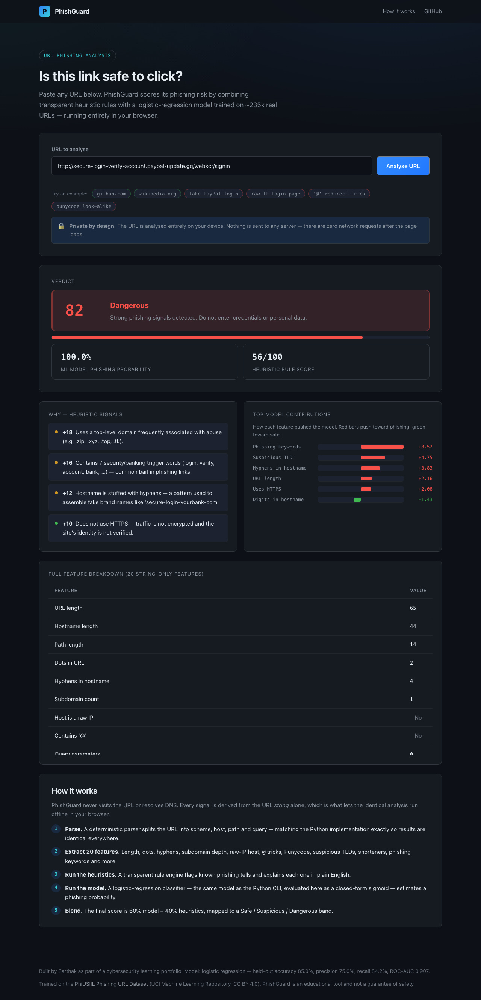

# PhishGuard — Phishing URL Detector

> Score any URL for phishing risk with transparent heuristics **plus** a machine-learning
> classifier — and the exact same model runs in the Python CLI and fully in your browser.


[](https://sarthakagrwal.github.io/phishing-url-detector/)

## Live demo

**https://sarthakagrwal.github.io/phishing-url-detector/**

The website is 100% client-side — paste a URL and it is analysed entirely in your browser.
It makes **zero network requests** after the page loads; the URL never leaves your device
(an end-to-end test asserts this).

## What it does

PhishGuard inspects a URL and returns a phishing-risk verdict — **Safe**, **Suspicious** or
**Dangerous** — by blending a transparent heuristic rule engine with a logistic-regression
classifier trained on ~235k real URLs. Every signal is derived from the URL *string alone*
(no DNS, no page fetch), which is what lets the **identical** feature extraction and model
run both in the Python CLI and in the browser.



## Features

- **20 string-only features** — URL/host/path lengths, dots, hyphens, subdomain depth,
  raw-IP hosts, the `@`-redirect trick, Punycode, IDN homographs, suspicious TLDs, URL
  shorteners, phishing keywords, digit ratios and more.
- **Transparent heuristics** — a rule engine that flags known phishing tells and explains
  each one in plain English ("Contains an '@' symbol — used to hide the real destination").
- **Machine-learning classifier** — a `StandardScaler` + `LogisticRegression` pipeline; at
  runtime it is evaluated as the closed-form sigmoid `σ(Σ wᵢ·zᵢ + b)`, so there is **no
  pickle to load and no library-version risk**.
- **Python ↔ JavaScript parity** — a shared fixture of ~50 URLs pins the expected feature
  vector and score; the pytest and vitest suites both check against it, so the two
  implementations can never silently diverge.
- **Coloured CLI** — `phishdetect <url>` with a verdict banner, heuristic breakdown, signed
  ML feature contributions, plus `--json`, `--batch` and an optional `--whois` domain-age
  lookup.
- **Fully client-side website** — Vite + TypeScript, no backend, no telemetry.

## How it works

### Feature extraction (URL string only)

A small **deterministic URL parser** — implemented identically in Python (`urlparse.py`)
and TypeScript (`urlparse.ts`) — splits the URL into scheme, host, path and query. It does
*not* use Python's `urllib.parse` or the browser `URL` API directly, because those diverge
on exactly the inputs a phishing detector cares about (hosts with `@`, missing schemes,
IPv6 literals, trailing dots). A URL with no scheme has `http://` prepended on both sides
before parsing. From the parse, 20 numeric features are computed.

### Heuristic rule engine

Each rule inspects the feature vector and, when triggered, adds risk points and a
human-readable reason. The points sum to a 0–100 heuristic score. This is the *explainable*
half of the detector.

### The machine-learning model

The classifier is a logistic regression. Because a logistic regression's prediction is the
closed form `sigmoid(Σ wᵢ·zᵢ + b)` where `zᵢ = (xᵢ − meanᵢ)/scaleᵢ`, every parameter is
stored in `models/model_meta.json` and **both** `model.py` and the generated `model.ts`
implement that one formula directly. No model-to-code transpiler is used. The training
script verifies the closed-form predictor reproduces scikit-learn's output to within
1e-9 before saving.

### Blended verdict

The final score is **60% model + 40% heuristics**, mapped to a band:
`< 35` Safe · `35–65` Suspicious · `≥ 65` Dangerous.

### Model performance — honest numbers

Trained on the **PhiUSIIL Phishing URL Dataset** (UCI #967). Held-out test-set metrics
(20% stratified split, `random_state=42`):

| Metric    | Score |
|-----------|-------|
| Accuracy  | 0.850 |
| Precision | 0.750 |
| Recall    | 0.842 |
| F1        | 0.793 |
| ROC-AUC   | 0.907 |

**An honest caveat on the dataset.** Every *legitimate* URL in PhiUSIIL is a bare site
home page (`https://www.<domain>` — no path, always HTTPS), whereas phishing URLs often
carry deep paths. A model trained on the raw set learns the spurious shortcut
"has a path ⇒ phishing" and would wrongly flag legitimate deep links like
`github.com/user/repo`. To break that shortcut, the training script **augments the
legitimate class** with realistic deep-link URLs synthesised from the *same known-good
domains* (varied scheme/`www`/path, no phishing keywords — no new domains invented). This
deliberately trades a few points of headline precision for a model that generalises to
real-world URLs. The augmentation is documented in `ml/train.py` and recorded in
`model_meta.json`. Heuristics and the model are complementary: e.g. the model alone is
weak on pure homograph hosts, which the heuristic engine catches directly.

PhishGuard is an educational tool and not a guarantee of safety.

## Quickstart

### Python CLI

```bash
# from the repo root
python3 -m venv .venv
./.venv/bin/pip install -e ".[dev]"          # core + tests
# optional: ./.venv/bin/pip install -e ".[whois]"   for --whois domain age

# analyse a single URL
./.venv/bin/phishdetect https://example.com/login

# machine-readable output
./.venv/bin/phishdetect "http://192.168.0.1/verify" --json

# analyse a file of URLs (one per line)
./.venv/bin/phishdetect --batch urls.txt

# add optional WHOIS domain-age context (needs the [whois] extra + network)
./.venv/bin/phishdetect example.com --whois
```

### Website (local dev)

```bash
cd web
npm install
npm run dev          # http://localhost:5173/phishing-url-detector/
npm run build        # production build into web/dist
npm run preview      # serve the built site on :4173
```

### Retraining the model (optional)

The trained model (`models/model_meta.json`, `models/phishing_model.joblib`) and the
generated `web/src/generated/model.ts` are committed — CI uses them as-is and does not
retrain. To rebuild them from scratch:

```bash
./.venv/bin/pip install -e ".[ml]"
./.venv/bin/python ml/train.py                   # fetch dataset, train, write model files
./.venv/bin/python ml/export_js.py               # write web/src/generated/model.ts
./.venv/bin/python fixtures/build_parity_fixture.py   # refresh the parity fixture
```

## Testing

```bash
# Python — unit + parity tests
./.venv/bin/pytest -q

# Website — vitest unit tests (incl. Python/JS parity against the shared fixture)
cd web && npm run test

# Website — Playwright end-to-end tests (built + previewed site)
cd web && npx playwright install chromium && npm run test:e2e
```

The parity tests (`tests/test_parity.py` and the vitest suites) consume the **same**
`fixtures/parity_urls.json` — if the Python and TypeScript implementations ever drift, a
suite goes red. The e2e suite includes a test that intercepts every request and asserts
**zero** network calls are made during analysis.

## Project structure

```
phishing-url-detector/
  phishdetect/            Python core + CLI
    urlparse.py           deterministic URL parser (mirrored in TS)
    suffix_list.py        bundled public-suffix subset (mirrored in TS)
    features.py           the 20-feature extractor
    heuristics.py         transparent rule engine
    model.py              closed-form logistic-regression predictor
    classify.py           end-to-end blended classification
    whois_enrich.py       optional, CLI-only domain-age lookup
    cli.py                the `phishdetect` command
  ml/
    train.py              fetch PhiUSIIL, train, write model_meta.json + joblib
    export_js.py          write web/src/generated/model.ts from model_meta.json
  models/                 committed model artefacts (JSON + joblib)
  fixtures/
    parity_urls.json      shared Python<->JS parity fixture
    build_parity_fixture.py
  tests/                  pytest suite (features, heuristics, model, classify, parity, cli)
  web/                    Vite + TypeScript site (the GitHub Pages app)
    src/                  features.ts / heuristics.ts / predict.ts ports + UI
    src/generated/        the generated model.ts
    e2e/                  Playwright tests
```

## Data sources / credits

This project uses the **PhiUSIIL Phishing URL Dataset** from the
[UCI Machine Learning Repository](https://archive.ics.uci.edu/dataset/967/phiusiil+phishing+url+dataset)
(dataset #967), licensed **CC BY 4.0**. Only the `URL` and `label` columns are used; all 20
features are recomputed from the URL strings. The dataset's documented label encoding is
`1 = legitimate, 0 = phishing`; the training script verifies this and remaps so that, in
this project, `1` always means phishing.

## License

MIT — see [LICENSE](LICENSE).

---

This project was built as part of a cybersecurity learning portfolio.
